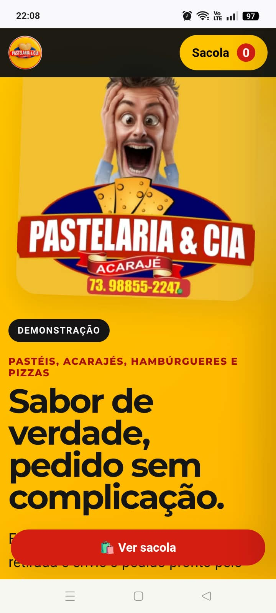

<div align="center">

# 🥟 Pastelaria & Cia — Cardápio Digital

### Cardápio online responsivo com carrinho e pedidos pelo WhatsApp


### 🌐 [VER DEMONSTRAÇÃO ONLINE](https://sule-sampaio.github.io/pastelaria-cia-demo/)

</div>

---

## 📖 Sobre o projeto

Este projeto é uma demonstração de **cardápio digital para a Pastelaria & Cia**, desenvolvida com foco em tornar o processo de pedidos mais simples, rápido e organizado, principalmente pelo celular.

A proposta surgiu a partir de um problema real: o estabelecimento utilizava um serviço externo de cardápio digital que deixou de funcionar corretamente.

A solução permite que o cliente navegue pelo cardápio, escolha produtos, personalize o pedido, selecione entrega ou retirada, escolha a forma de pagamento e envie o pedido completo diretamente para o WhatsApp do estabelecimento.

> ⚠️ Este é um projeto demonstrativo e não representa atualmente o site oficial da Pastelaria & Cia.

---

## 📸 Preview

O projeto possui layout responsivo, adaptando a experiência para computadores e smartphones.

### 🖥️ Desktop


### 📱 Mobile



> Para exibir os prints acima, adicione as duas capturas ao diretório `assets` com os nomes `preview-desktop.png` e `preview-mobile.png`.

### 🚀 [Testar o cardápio ao vivo](https://sule-sampaio.github.io/pastelaria-cia-demo/)

---

## ✨ Funcionalidades

- 🍔 Cardápio dividido por categorias
- 🔎 Busca de produtos
- 📏 Seleção de tamanhos M/G
- 🛒 Sacola de compras
- ➕ Controle de quantidade
- 🧀 Personalização com adicionais
- 💰 Adicionais gratuitos e pagos
- 📝 Observações personalizadas por produto
- 🧮 Cálculo automático do pedido
- 🚚 Opção de entrega
- 💵 Taxa de entrega fixa de **R$ 8,00**
- 🏪 Opção de retirada no estabelecimento
- 💳 Pix, cartão de crédito e cartão de débito
- 💵 Dinheiro com campo para troco
- 📍 Informações de localização
- 📲 Finalização diretamente pelo WhatsApp
- 💾 Sacola armazenada com LocalStorage
- 📱 Layout responsivo

---

## 🛒 Como funciona o pedido

```text
Cliente acessa o cardápio
          ↓
    Escolhe o produto
          ↓
Seleciona tamanho/adicionais
          ↓
   Adiciona à sacola
          ↓
     Revisa o pedido
          ↓
  Entrega ou retirada
          ↓
  Forma de pagamento
          ↓
 Sistema calcula o total
          ↓
   Finaliza no WhatsApp
```

O objetivo é reduzir a quantidade de mensagens necessárias para montar um pedido.

Em vez de:

**Cliente → pergunta cardápio → pergunta preço → escolhe → informa endereço → pagamento**

A experiência passa a ser:

**Cliente → monta o pedido no site → envia tudo pronto pelo WhatsApp**

---

## 🚚 Entrega e retirada

### 🚚 Entrega

A entrega possui taxa fixa de **R$ 8,00**, adicionada automaticamente ao total quando essa opção é selecionada.

### 🏪 Retirada

O cliente também pode escolher retirar o pedido diretamente no estabelecimento, sem cobrança da taxa de entrega.

---

## 💳 Formas de pagamento

| Forma de pagamento | Disponível |
|---|:---:|
| Pix | ✅ |
| Cartão de crédito | ✅ |
| Cartão de débito | ✅ |
| Dinheiro | ✅ |

Quando o cliente seleciona **Dinheiro**, também pode informar se precisa de troco.

---

## 📲 Integração com WhatsApp

Ao finalizar o pedido, o sistema gera automaticamente uma mensagem organizada contendo produtos, quantidades, tamanhos, adicionais, observações, tipo de atendimento, endereço, forma de pagamento, subtotal, taxa de entrega e total do pedido.

Depois disso, o cliente é direcionado para o WhatsApp da Pastelaria & Cia com as informações prontas para envio.

---

## 🛠️ Tecnologias utilizadas

| Tecnologia | Aplicação |
|---|---|
| **HTML5** | Estrutura e organização do cardápio |
| **CSS3** | Layout, responsividade e identidade visual |
| **JavaScript** | Sacola, adicionais, checkout e lógica do pedido |
| **LocalStorage** | Persistência da sacola no navegador |
| **WhatsApp** | Finalização e envio do pedido |
| **GitHub Pages** | Hospedagem da demonstração online |

---

## 📱 Responsividade

O projeto foi desenvolvido com atenção especial à experiência mobile, já que clientes de estabelecimentos locais normalmente chegam ao cardápio através do Instagram e WhatsApp.

O layout se adapta a smartphones, tablets, notebooks e desktops.

---

## 🎯 Problema → Solução

| Problema | Solução desenvolvida |
|---|---|
| Cardápio antigo indisponível | Cardápio web próprio |
| Pedido montado manualmente | Sacola digital |
| Cliente precisa perguntar preços | Valores disponíveis diretamente no cardápio |
| Adicionais informados por mensagem | Personalização no próprio site |
| Cálculo manual | Total calculado automaticamente |
| Informações espalhadas | Checkout organizado |
| Pedido digitado manualmente | Mensagem automática para WhatsApp |
| Dependência de aplicativo | Acesso direto pelo navegador |

---

## 📍 Pastelaria & Cia

**Pastelaria & Cia — Acarajé**

📍 Rua Durval Campos, São Jorge, nº 528  
Jaguaquara — BA

📱 **(73) 98855-2247**

📷 Instagram: **@pastelariaeciaofc**

---

## ⚠️ Aviso

Este projeto foi desenvolvido como uma **demonstração de solução digital**.

As marcas, logotipos, nomes e imagens da Pastelaria & Cia utilizados nesta demonstração pertencem aos seus respectivos proprietários.

O projeto não representa atualmente um site oficial do estabelecimento.

---

## 👨‍💻 Desenvolvedor

### Sule Sampaio

Projeto desenvolvido para demonstrar conhecimentos em **desenvolvimento Front-end**, criação de interfaces responsivas e desenvolvimento de soluções digitais para pequenos negócios.

### Conceitos aplicados

`HTML` • `CSS` • `JavaScript` • `DOM` • `LocalStorage` • `Responsividade` • `Carrinho de compras` • `Checkout` • `Integração com WhatsApp` • `GitHub Pages`

---

<div align="center">

## 🚀 Projeto online

### [🌐 ACESSAR CARDÁPIO DIGITAL](https://sule-sampaio.github.io/pastelaria-cia-demo/)

Se este projeto foi útil ou interessante, deixe uma ⭐ no repositório.

</div>
